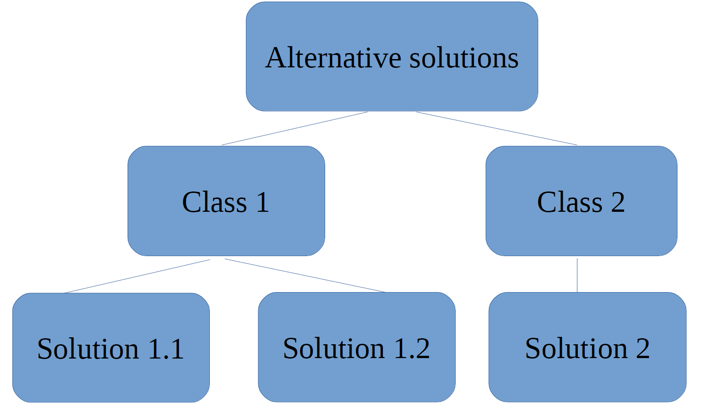

# Typical MSc thesis outline

## Important remarks

- All chapter/section header, contents of tables/figures should have sentence capitalization (only first word of a sentence is capital).

- When referring to a specific figure, table, etc. by number, capitalize that word (Figure 1, Table 3, Page 5)

- If there is a Section 1.1, then there must be Section 1.2. A list of one item is not a list!

- Export all plots and diagrams as vectorized PDF. This ensures high quality figures with small file size. If you must use bit mapped pictures (e.g. png, jpg), limit resolution to 300ppi.

1. Introduction

    1.1. Context (what is the project, where is it being carried out, how will this research have impact on the world)

    1.2. Challenges (what is the general problem and what are the possible challenges to solving it)

    1.3. Problem statement and research questions

    1.4. Thesis outline

2. Background
    
    Based on detailed analysis of the problem, discuss the various concepts related to the project that need more in-depth knowledge to understand the solution.

3. Alternative solutions
    
    Start this chapter with a figure of a tree to classify the alternative solutions into classes
    
    
    3.1. Solution class 1 (discuss the solutions in this class)

    3.2. Solution class 2 (discuss the solutions in this class)

    3.3. Solution comparison (create table to compare the solutions qualitatively (using ++ and --) or quantitatively (using numbers) to choose the appropriate solution to implement)
    
